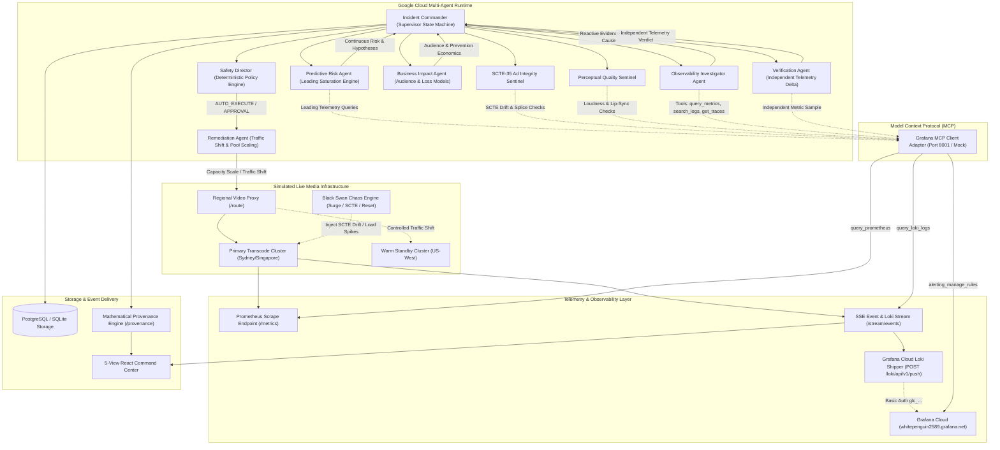
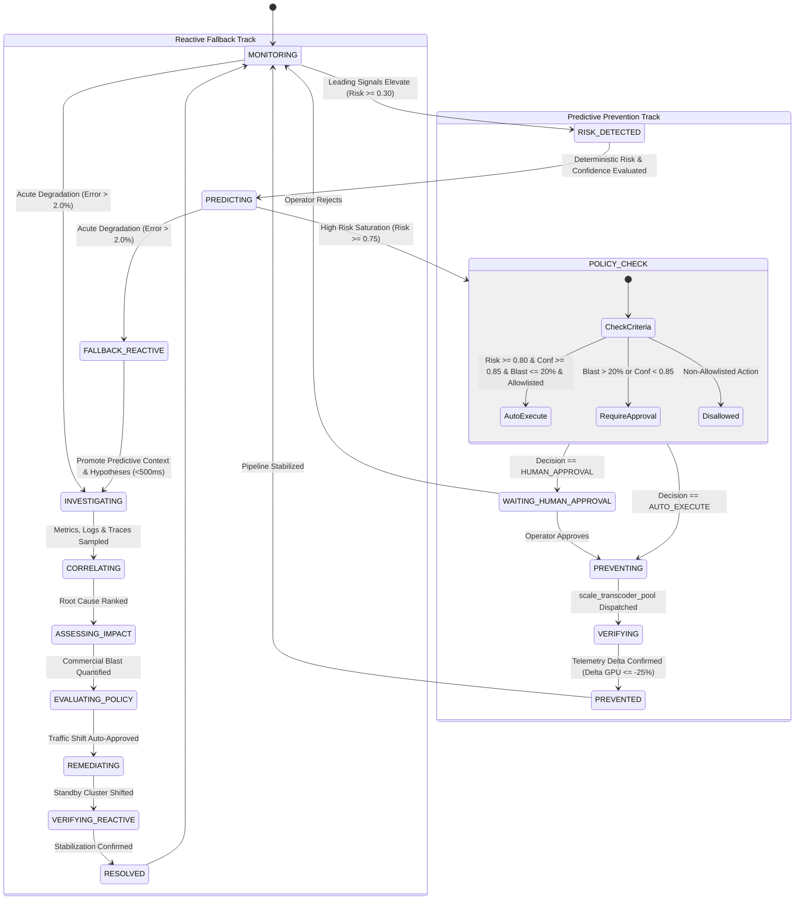

# Studio Guardian — System Architecture

**Autonomous Live Media Incident Director & Predictive Defense System**  
Built for the **Google Cloud & Grafana Labs Hackathon**

---

## 1. System Topology Overview

Studio Guardian operates as an autonomous, multi-agent operational supervisor designed specifically for high-stakes, large-scale live media broadcasts (World Cup finals, live sporting championships, global concert streams).



---

## 2. Multi-Agent Boundaries & Responsibilities

The logical agent hierarchy consists of the **Incident Commander** supervising specialized functional agents, media sentinels, and a deterministic safety policy director:

```
Incident Commander (Supervisor)
├── Predictive Risk Agent (Leading Telemetry & Saturation Projection)
├── SCTE-35 Ad Integrity Sentinel (Ad Timing Drift & Splice Mismatch)
├── Perceptual Quality Sentinel (EBU R128 Loudness & Lip-Sync)
├── Observability Investigator (Root Cause Multi-Signal Correlation)
├── Business Impact Agent (Audience Blast, Ad Burn & Prevention Economics)
├── Safety Director (Deterministic Gating & 20% Blast Radius Ceiling)
├── Remediation Agent (Traffic Shift & Capacity Scaling)
└── Verification Agent (Independent Telemetry Delta Validation)
```

| Specialist Agent | Core Responsibility | Runtime Model / Framework | Telemetry & Partner Integration |
| :--- | :--- | :--- | :--- |
| **Incident Commander** | Hierarchical supervisor; orchestrates dual-mode predictive and reactive lifecycles, database persistence, and SSE event streaming. | Google Cloud Agent Runtime | Cloud SQL PostgreSQL / SQLite |
| **Predictive Risk Agent** | Evaluates leading indicators (GPU saturation, worker queue depth, segment packaging latency) to forecast saturation 5–15 min in advance. | Deterministic Math + Gemini 2.5 | **Grafana MCP Client** |
| **SCTE-35 Ad Integrity Sentinel** | Audits ad splice cues for timing drift relative to PTS (±200ms bounds), splice alignment error, and ad pod drop ratios. | Rule-based Sentinel + Gemini 2.5 | **Loki Log Query & SCTE Parser** |
| **Perceptual Quality Sentinel** | Verifies broadcast compliance: EBU R128 loudness (-24 LUFS), A/V lip-sync drift, and video frame drop ratios. | EBU R128 Standard + Gemini 2.5 | **Media Environment Telemetry** |
| **Observability Investigator** | Multi-signal correlation; queries metrics, logs, traces, and firing alert rules to diagnose active root causes. | Gemini 2.5 via Google GenAI SDK | **Grafana MCP Client** |
| **Business Impact Agent** | Commercial impact & prevention economics; calculates audience at risk, ad burn rate, and counterfactual avoided loss. | Deterministic Math + Gemini 2.5 | Live Media Simulator |
| **Safety Director** | Deterministic policy engine; strictly enforces action allowlist, 20% predictive blast radius cap, and 85% confidence threshold. | Deterministic Policy Rules | Cryptographic Audit Ledger |
| **Remediation Agent** | Formulates minimal blast-radius operational fix (`scale_transcoder_pool`, `traffic_shift`). | Gemini 2.5 Structured Output | Video Routing Proxy (`/route`) |
| **Verification Agent** | Post-remediation validator; independently re-samples Grafana MCP to compute telemetry deltas ($\Delta\text{GPU} \le -25\%$). | Gemini 2.5 Evaluation | **Grafana MCP PromQL** |

---

## 3. Dual-Mode Operational State Machine

Studio Guardian operates in dual modes: **Predictive Operations** (proactive defense) and **Reactive Incident Director** (emergency triage).



---

## 4. Observability & Telemetry Pipeline

Studio Guardian implements a multi-tier telemetry architecture:

1. **Standard Prometheus Exposition (`/metrics`)**:
   Exposes both infrastructure and semantic media quality gauges:
   - `studio_guardian_playback_error_rate` (Customer-facing buffer ratio)
   - `studio_guardian_transcoder_latency_seconds` (Segment encode delay)
   - `studio_guardian_gpu_utilization_pct` (Leading compute saturation)
   - `studio_guardian_transcoder_queue_depth` (Pending video chunks)
   - `studio_guardian_scte_timing_drift_ms` (Ad splice timing drift)
   - `studio_guardian_splice_alignment_error_ms` (Splice boundary error)
   - `studio_guardian_concurrent_viewers` / `studio_guardian_affected_viewers`
   - `studio_guardian_av_sync_drift_ms` / `studio_guardian_loudness_deviation_lufs`

2. **Server-Sent Events (SSE) Live Stream (`/api/v1/stream/events`)**:
   Emits high-frequency (1 Hz) telemetry heartbeats and real-time Loki log batches (`LOKI_LOG_BATCH`) directly to connected browsers.

3. **Grafana Cloud Integration & Authentication Architecture**:
   - **Service Account Token (`glsa_...`)**: Authenticates against Grafana Cloud REST APIs (`whitepenguin2589.grafana.net/api/dashboards/db`) to publish and manage dashboard specifications.
   - **Cloud Access Policy Token (`glc_...`)**: Authenticates against the hosted Loki push endpoint (`https://logs-prod-026.grafana.net/loki/api/v1/push`) with `logs:write` scope to ingest structured broadcast logs into Grafana Cloud.

4. **In-Website Live Observability Console**:
   Provides an embedded, zero-configuration Grafana experience directly inside the command center (Tab 5) featuring Recharts-powered live streaming metric graphs and a dark-mode auto-scrolling Loki terminal console.

---

## 5. Mathematical Provenance & Verifiable Evidence

To satisfy stringent audit requirements in mission-critical broadcasting, Studio Guardian grounds all decisions in deterministic mathematics:

1. **Composite Risk Formula**:
   $$R(t) = \sum_{i=1}^{n} w_i \cdot s_i(t)$$
   Where:
   - $w_{\text{gpu}} = 0.25$ (GPU Compute Saturation)
   - $w_{\text{queue}} = 0.20$ (Transcoder Queue Buildup)
   - $w_{\text{latency}} = 0.20$ (Segment Packaging Latency)
   - $w_{\text{error}} = 0.15$ (Playback Buffer Ratio)
   - $w_{\text{viewer}} = 0.10$ (Audience Concurrency Surge)
   - $w_{\text{deploy}} = 0.10$ (Recent Deployment Proximity)

2. **Estimated Time-to-Impact**:
   $$T_{\text{impact}} = \frac{\text{Capacity Threshold} - \text{Current Value}}{\text{Rate of Change } (\Delta/\Delta t)}$$

3. **Verifiable Audit Trail**:
   Every risk calculation produces an immutable snapshot stored in `prediction_evidence` and `runtime_evidence` tables with:
   - Target datasource identifier (`PROMETHEUS_MUMBAI`, `LOKI_TRANSCODER`)
   - Exact PromQL / LogQL query expression
   - Query execution latency in milliseconds
   - Cryptographic SHA-256 hash verifying data integrity
   - Verifiable via `GET /api/v1/predictive/provenance`
