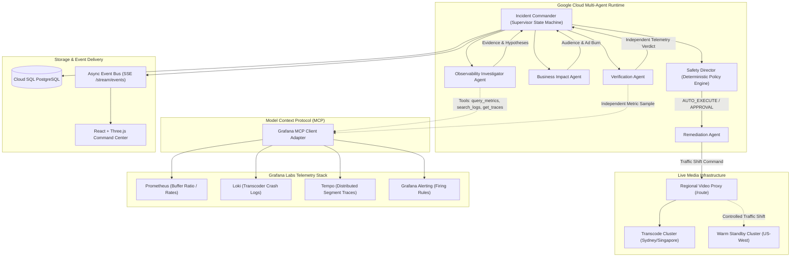
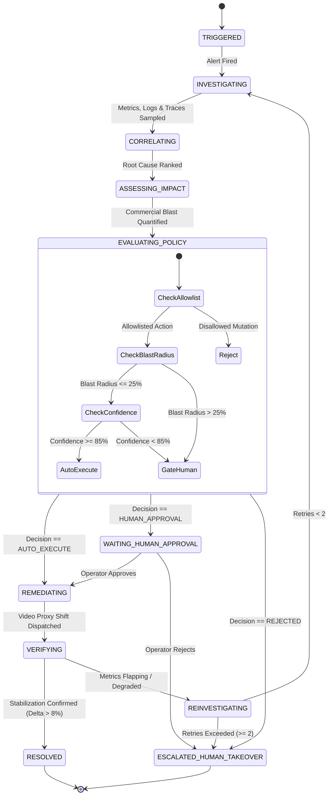

# Studio Guardian — System Architecture

**Autonomous Live Media Incident Director**  
Built for the **Google Cloud & Grafana Labs Hackathon**

---

## 1. System Topology Overview

Studio Guardian operates as an autonomous, multi-agent operational supervisor designed specifically for high-stakes, large-scale live media broadcasts (such as global cricket finals, live sporting championships, and concert streams).

---

## 2. Multi-Agent Boundaries & Responsibilities

| Specialist Agent | Core Responsibility | Runtime Model / Framework | Partner Integration |
| :--- | :--- | :--- | :--- |
| **Incident Commander** | Hierarchical supervisor; enforces state transitions, tracks retries, manages database persistence. | Google Cloud Agent Runtime | Cloud SQL PostgreSQL |
| **Observability Investigator** | Multi-signal correlation; queries metrics, logs, traces, and firing alerts to diagnose root cause. | Gemini 2.5 via Google GenAI SDK | **Grafana MCP Client** |
| **Business Impact Agent** | Commercial impact calculation; calculates impacted audience, VIP tiers, ad revenue burn, and SLA liability. | Deterministic Math + Gemini 2.5 | Live Media Simulator |
| **Safety Director** | Policy engine; strictly enforces action allowlist, 25% blast radius cap, and 85% confidence threshold. | Deterministic Policy Rules | Audit Logging |
| **Remediation Agent** | Formulates minimal blast-radius operational fix and dispatches traffic shift to video routing proxy. | Gemini 2.5 Structured Output | Video Routing Proxy |
| **Verification Agent** | Post-remediation validator; independently re-samples Grafana MCP to compute metric deltas and stability. | Gemini 2.5 Evaluation | **Grafana MCP PromQL** |

---

## 3. Operational State Machine

---

## 4. Controlled Remediation vs Real Infrastructure

Studio Guardian enforces a strict separation between read-only observability and controlled remediation:
1. **Telemetry Ingestion**: The agent queries Grafana MCP using real tool definitions (`query_prometheus_metrics`, `search_loki_logs`, `get_tempo_traces`, `list_grafana_alerts`).
2. **Safety Gating**: Actions outside `{TRAFFIC_SHIFT, CONTAINER_RESTART, SCALE_REPLICAS}` are immediately rejected.
3. **Execution**: The Remediation Agent communicates directly with the video routing controller endpoint (`/route`) to divert regional HLS/DASH traffic away from the degraded cluster.
4. **Verification**: The Verification Agent independently evaluates stabilization without trusting the Remediation Agent's status.
