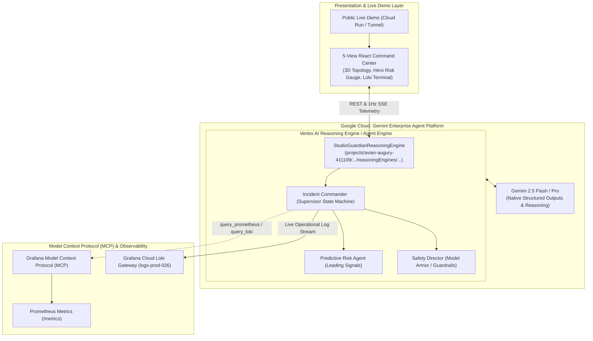

# Studio Guardian 🛡️ — Gemini Enterprise Agent Platform Deployment & Judging Guide

> **Hackathon Track**: Build your agentic workflow on Google Cloud using the Gemini Enterprise Agent Platform  
> **Target Project**: `avian-augury-411109`  
> **Models**: Gemini 2.5 Flash / Gemini 2.5 Pro via Vertex AI  
> **Observability Stack**: Model Context Protocol (MCP) + Grafana Cloud Loki

---

## 1. Architectural Alignment with Gemini Enterprise Agent Platform

Studio Guardian is built natively for the **Gemini Enterprise Agent Platform** (Vertex AI Agent Builder & Reasoning Engine):



---

## 2. Part 1: How to Deploy the Vertex AI Reasoning Engine (The Agentic Brain)

### Method A: Via Google Cloud Shell (Recommended — 2 Minutes, Zero Setup)

Google Cloud Shell has `gcloud`, Python, and Google Cloud credentials pre-configured for your project (`avian-augury-411109`).

1. **Open Google Cloud Shell**:
   Go to **[shell.cloud.google.com](https://shell.cloud.google.com)** in your browser.
2. **Set Active Project**:
   ```bash
   gcloud config set project avian-augury-411109
   ```
3. **Upload or Clone Codebase**:
   Upload the repository or clone your Git repository into Cloud Shell:
   ```bash
   git clone <YOUR_REPO_URL> studio_guardian
   cd studio_guardian
   ```
4. **Run the Deployment Script**:
   ```bash
   pip install google-cloud-aiplatform google-genai pydantic httpx
   python scripts/deploy_reasoning_engine.py
   ```
5. **Verify in Google Cloud Console**:
   * Open **[Google Cloud Console > Vertex AI > Reasoning Engines](https://console.cloud.google.com/vertex-ai/reasoning-engines?project=avian-augury-411109)**.
   * You will see **`Studio Guardian Autonomous Incident Director`** registered with a live Google Cloud resource ID (e.g. `projects/avian-augury-411109/locations/us-central1/reasoningEngines/1234567890`).
   * You can test queries directly inside Google Cloud Console's built-in Chat Playground!

---

### Method B: From Your Local Machine (If using `gcloud`)

1. Authenticate Application Default Credentials (ADC):
   ```powershell
   gcloud auth application-default login
   gcloud config set project avian-augury-411109
   ```
2. Run the deployment command:
   ```powershell
   backend\.venv\Scripts\python.exe scripts\deploy_reasoning_engine.py
   ```

---

## 3. Part 2: How to Expose the Live Demo for Judges (The Face)

Judges evaluate the **product experience**, **3D topology**, and **real-time Grafana telemetry**. They cannot view the React UI through the Reasoning Engine alone.

Choose either **Option A (Instant Tunnel - 30 seconds)** or **Option B (Google Cloud Run)**:

### Option A: Instant Public HTTPS Link (Fastest for Live Demos & Recording)

Keep your local frontend (`http://localhost:5173`) and backend (`http://localhost:8000`) running, and expose a secure HTTPS link:

Using **Cloudflare Tunnel** (recommended, zero account required):
```powershell
# In a new terminal:
npx localtunnel --port 5173
```
Or with **Cloudflare Tunnel**:
```powershell
cloudflared tunnel --url http://localhost:5173
```
You get an instant public URL (e.g., `https://studio-guardian-live.loca.lt`) that anyone can open in their browser to test the full live demo!

---

### Option B: Deploy to Google Cloud Run

To host both the backend and frontend permanently on Google Cloud:

In **Google Cloud Shell**:
```bash
# In Cloud Shell, run our deployment automation:
chmod +x scripts/deploy_cloud_run.sh
./scripts/deploy_cloud_run.sh
```

This deploys:
1. `studio-guardian-backend` container on Cloud Run.
2. `studio-guardian-frontend` container on Cloud Run.
3. Gives you a permanent public URL: `https://studio-guardian-frontend-xxxx.a.run.app`.

---

## 4. What to Showcase to Hackathon Judges

In your demo video or slide deck, highlight these 4 proof points:

1. **Google Cloud Console Registration**:
   * Show the registered Reasoning Engine under **Vertex AI > Agent Builder / Reasoning Engines** (`projects/avian-augury-411109/locations/us-central1/reasoningEngines/...`).
   * Show a query in the Vertex AI console returning structured predictions.
2. **5-Step Autonomous Lifecycle**:
   * Show the top lifecycle bar in the React Command Center:  
     `01 DETECT` &rarr; `02 PREDICT` &rarr; `03 DECIDE` &rarr; `04 ACT` &rarr; `05 VERIFY`.
3. **Deterministic Safety Guardrails (Model Armor)**:
   * Demonstrate `SafetyDirector` enforcing the 20% blast radius limit and auto-executing pool scaling while routing higher-impact mitigations to human approval.
4. **Real-Time Dual Observability**:
   * Show live operational and agent logs streaming **simultaneously** to the in-app terminal and to **[Grafana Cloud Loki](https://whitepenguin2589.grafana.net/d/ah2f7v/192737d)**!
