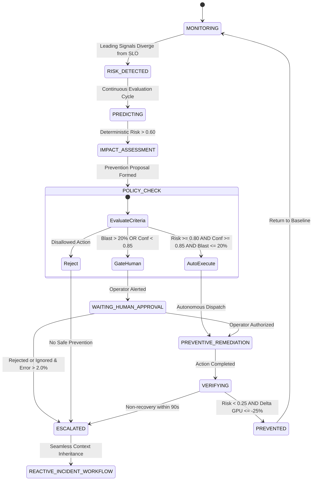

# Phase 1 Data Model: Predictive Prevention & Proactive Remediation

**Feature**: [`specs/002-predictive-prevention/spec.md`](file:///c:/Coding_learning/studio_guardian/studio_guardian/specs/002-predictive-prevention/spec.md)
**Status**: Complete

---

## 1. Relational Entities & Schemas

```mermaid
erDiagram
    PREDICTIVE_SNAPSHOT ||--o{ PREDICTION_EVIDENCE : "evidenced_by"
    PREDICTIVE_SNAPSHOT ||--|| PREDICTION_DECISION : "evaluated_to"
    PREDICTION_DECISION ||--o| PREVENTION_ACTION : "triggers"
    PREVENTION_ACTION ||--|| PREVENTION_VERIFICATION : "audited_by"
    PREVENTION_VERIFICATION ||--o| PREDICTION_FINGERPRINT : "indexed_as"

    PREDICTIVE_SNAPSHOT {
        uuid id PK
        timestamp sampled_at
        float gpu_utilization_raw
        float transcoder_latency_raw
        int queue_depth_raw
        float playback_error_rate_raw
        int active_viewers_raw
        float gpu_utilization_norm
        float transcoder_latency_norm
        float queue_growth_slope
        float error_growth_slope
        float viewer_growth_slope
        float regional_saturation_norm
        float deployment_risk_norm
        string channel_id
        string region
    }

    PREDICTION_EVIDENCE {
        uuid id PK
        uuid snapshot_id FK
        timestamp queried_at
        string tool_name
        string query_expression
        json raw_response
        float query_duration_ms
        string provider_source
    }

    PREDICTION_DECISION {
        uuid id PK
        uuid snapshot_id FK
        timestamp decided_at
        float risk_score
        string risk_level
        float confidence_score
        json risk_contributors
        string predicted_failure_mode
        int window_minutes_min
        int window_minutes_max
        string failure_hypothesis
        string reasoning_summary
        string agent_session_id
        string runtime_metadata
    }

    PREVENTION_ACTION {
        uuid id PK
        uuid decision_id FK
        timestamp dispatched_at
        string action_type
        string target_service
        json action_parameters
        float blast_radius_pct
        float expected_loss_without_action
        float cost_of_prevention
        float expected_avoided_exposure
        string policy_verdict
        string authorization_tier
        string operator_id
        string execution_status
        timestamp completed_at
    }

    PREVENTION_VERIFICATION {
        uuid id PK
        uuid action_id FK
        timestamp verified_at
        float risk_score_before
        float risk_score_after
        float gpu_before
        float gpu_after
        float latency_before
        float latency_after
        float error_rate_before
        float error_rate_after
        string verification_verdict
        float net_avoided_loss
        int estimated_viewers_protected
    }

    PREDICTION_FINGERPRINT {
        uuid id PK
        uuid verification_id FK
        timestamp recorded_at
        string service_name
        string failure_pattern
        json signature_signals
        string proven_action
        int times_applied
        float success_rate
    }
```

---

## 2. Entity Field Specifications

### 2.1 PredictiveSnapshot
Captures normalized feature vectors and raw sensor telemetry at a single evaluation point.
- `id` (UUID, Primary Key): Unique snapshot identifier.
- `sampled_at` (DateTime, Indexed): Timestamp of telemetry capture.
- `channel_id` (String): Broadcast stream identifier (e.g., `star-sports-hindi`).
- `region` (String): Compute region (e.g., `ap-south-1`).
- `gpu_utilization_raw` (Float): Raw GPU percentage ($0.0 - 100.0$).
- `transcoder_latency_raw` (Float): Ingest-to-encode latency ($ms$).
- `queue_depth_raw` (Integer): Buffered chunk queue length.
- `playback_error_rate_raw` (Float): Client error rate percentage.
- `active_viewers_raw` (Integer): Total concurrent viewers.
- `gpu_utilization_norm` (Float, $[0.0, 1.0]$): Min-max clamped normalized score.
- `transcoder_latency_norm` (Float, $[0.0, 1.0]$): Min-max clamped latency score.
- `queue_growth_slope` (Float, $[0.0, 1.0]$): 60-second linear regression slope.
- `error_growth_slope` (Float, $[0.0, 1.0]$): 60-second error rate growth slope.
- `viewer_growth_slope` (Float, $[0.0, 1.0]$): Concurrency trend acceleration.
- `regional_saturation_norm` (Float, $[0.0, 1.0]$): Regional compute ceiling pressure.
- `deployment_risk_norm` (Float, $[0.0, 1.0]$): Recency penalty for recent code/config push.

### 2.2 PredictionEvidence
Auditable record of all external tool queries executed against Grafana MCP.
- `id` (UUID, Primary Key): Record identifier.
- `snapshot_id` (UUID, Foreign Key → `PredictiveSnapshot.id`): Associated snapshot.
- `queried_at` (DateTime): Query dispatch timestamp.
- `tool_name` (String): Tool invoked (e.g., `query_prometheus_metrics`, `search_loki_logs`, `list_grafana_alerts`).
- `query_expression` (String): PromQL/LogQL expression.
- `raw_response` (JSON): Sanitized response payload.
- `query_duration_ms` (Float): Execution latency in milliseconds.
- `provider_source` (String): `LIVE_GRAFANA_MCP` or `MOCK_GRAFANA_MCP`.

### 2.3 PredictionDecision
Synthesis produced by the deterministic risk model and Gemini reasoning.
- `id` (UUID, Primary Key): Decision identifier.
- `snapshot_id` (UUID, Foreign Key → `PredictiveSnapshot.id`): Associated snapshot.
- `decided_at` (DateTime): Decision calculation timestamp.
- `risk_score` (Float, $[0.0, 1.0]$): Weighted composite risk score.
- `risk_level` (String): Tier enum: `HEALTHY` (<0.30), `WATCH` (0.30–0.59), `ELEVATED` (0.60–0.79), `HIGH` (0.80–0.89), `IMMINENT` (>=0.90).
- `confidence_score` (Float, $[0.0, 1.0]$): Statistical confidence based on data completeness and signal concordance.
- `risk_contributors` (JSON): Mathematical points breakdown (e.g., `{"gpu_pressure": 23.5, "queue_growth": 21.0, "latency_pressure": 18.0, ...}`).
- `predicted_failure_mode` (String): Classification (e.g., `transcoder_capacity_exhaustion`).
- `window_minutes_min` (Integer): Estimated earliest degradation minute.
- `window_minutes_max` (Integer): Estimated latest degradation minute.
- `failure_hypothesis` (Text): Gemini-generated plain-English explanation.
- `reasoning_summary` (Text): Non-technical operator briefing.
- `agent_session_id` (String): Google Cloud Agent Engine execution ID.
- `runtime_metadata` (JSON): Model name, location, and token metrics.

### 2.4 PreventionAction
Record of proposed, governed, and dispatched preventive remediation.
- `id` (UUID, Primary Key): Action identifier.
- `decision_id` (UUID, Foreign Key → `PredictionDecision.id`): Associated decision.
- `dispatched_at` (DateTime): Dispatch timestamp.
- `action_type` (String): Allowlisted action name (`scale_transcoder_pool`, etc.).
- `target_service` (String): Service identifier (e.g., `transcoder-worker-pool`).
- `action_parameters` (JSON): Dispatch payload (e.g., `{"scale_factor": 1.5, "additional_nodes": 4}`).
- `blast_radius_pct` (Float, $[0.0, 100.0]$): Scope of traffic/compute impacted.
- `expected_loss_without_action` (Float): Projected revenue/churn exposure ($).
- `cost_of_prevention` (Float): Compute/operational cost of action ($).
- `expected_avoided_exposure` (Float): Net projected value ($).
- `policy_verdict` (String): `AUTO_EXECUTE`, `REQUIRE_APPROVAL`, `REJECTED`.
- `authorization_tier` (String): `AUTONOMOUS` or `HUMAN_APPROVED`.
- `operator_id` (String, Nullable): Authorizing operator if gated.
- `execution_status` (String): `PENDING`, `DISPATCHED`, `COMPLETED`, `FAILED`.
- `completed_at` (DateTime, Nullable): Completion timestamp.

### 2.5 PreventionVerification
Independent post-action telemetry audit and counterfactual accounting.
- `id` (UUID, Primary Key): Verification identifier.
- `action_id` (UUID, Foreign Key → `PreventionAction.id`): Associated action.
- `verified_at` (DateTime): Verification completion timestamp.
- `risk_score_before` (Float): Pre-action risk score.
- `risk_score_after` (Float): Post-action risk score.
- `gpu_before` (Float): Pre-action GPU percentage.
- `gpu_after` (Float): Post-action GPU percentage.
- `latency_before` (Float): Pre-action latency (ms).
- `latency_after` (Float): Post-action latency (ms).
- `error_rate_before` (Float): Pre-action playback error rate.
- `error_rate_after` (Float): Post-action playback error rate.
- `verification_verdict` (String): `PREVENTION_VERIFIED` or `PREVENTION_FAILED`.
- `net_avoided_loss` (Float): Realized commercial exposure avoided ($).
- `estimated_viewers_protected` (Integer): Estimated audience protected from degradation.

### 2.6 PredictionFingerprint
Persistent historical signature used by the Predictive Memory store.
- `id` (UUID, Primary Key): Fingerprint identifier.
- `verification_id` (UUID, Foreign Key → `PreventionVerification.id`): Originating verification.
- `recorded_at` (DateTime): Index timestamp.
- `service_name` (String): Target service.
- `failure_pattern` (String): Pattern classification.
- `signature_signals` (JSON): Vector of leading indicator trends.
- `proven_action` (String): Effective mitigation strategy.
- `times_applied` (Integer): Longitudinal success count.
- `success_rate` (Float): Historical efficacy percentage.

---

## 3. Operational State Machine

