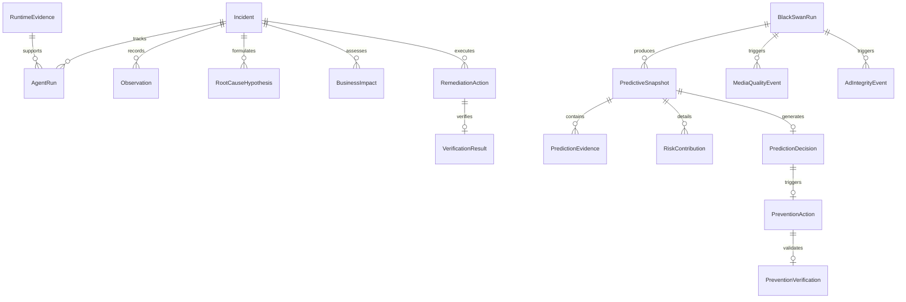

# Data Model: Predictive Media Protection & Black Swan Defense

**Feature**: Predictive Media Protection & Black Swan Defense  
**Branch**: `003-predictive-defense`  
**Date**: 2026-09-08  
**Status**: Design Complete  

---

## 1. Entity Relationship Diagram



---

## 2. New Database Entities

### 2.1 `predictive_snapshots`
Represents an instantaneous or sliding telemetry observation window captured from Grafana MCP.

| Column | Type | Nullable | Constraints / Default | Description |
|---|---|---|---|---|
| `id` | `UUID` | No | PK, default `uuid4()` | Unique snapshot identifier |
| `sampled_at` | `DateTime(tz)` | No | Default `now(utc)`, Index | Timestamp when telemetry was sampled |
| `channel_id` | `String(100)` | No | Default `'star-sports-live'` | Broadcast stream or channel identifier |
| `region` | `String(50)` | No | Default `'ap-south-1'` | Geographic delivery region |
| `gpu_utilization_raw` | `Float` | No | Default `0.0` | Raw GPU utilization (%) |
| `transcoder_latency_raw` | `Float` | No | Default `0.0` | Transcoder segment delivery latency (ms) |
| `queue_depth_raw` | `Integer` | No | Default `0` | Active transcoder worker queue depth |
| `playback_error_rate_raw` | `Float` | No | Default `0.0` | Client player-side error rate (%) |
| `active_viewers_raw` | `Integer` | No | Default `0` | Total concurrent active stream viewers |
| `gpu_utilization_norm` | `Float` | No | Default `0.0` | Dimensionless normalized GPU `[0.0, 1.0]` |
| `transcoder_latency_norm` | `Float` | No | Default `0.0` | Dimensionless normalized latency `[0.0, 1.0]` |
| `queue_growth_slope` | `Float` | No | Default `0.0` | 60s queue depth linear slope (`dy/dt`) |
| `queue_acceleration` | `Float` | No | Default `0.0` | 2nd derivative queue acceleration (`d²y/dt²`) |
| `error_growth_slope` | `Float` | No | Default `0.0` | 60s playback error linear slope |
| `viewer_growth_slope` | `Float` | No | Default `0.0` | 60s audience growth slope |
| `regional_saturation_norm` | `Float` | No | Default `0.0` | Dimensionless regional saturation `[0.0, 1.0]` |
| `deployment_risk_norm` | `Float` | No | Default `0.0` | Recency penalty `[0.0, 1.0]` |

### 2.2 `risk_contributions`
Stores the individual signal contribution points breakdown for a snapshot to preserve mathematical provenance.

| Column | Type | Nullable | Constraints / Default | Description |
|---|---|---|---|---|
| `id` | `UUID` | No | PK, default `uuid4()` | Unique contribution record identifier |
| `snapshot_id` | `UUID` | No | FK(`predictive_snapshots.id`), Index | Parent predictive snapshot |
| `signal_name` | `String(50)` | No | Index | e.g., `gpu_pressure`, `queue_growth` |
| `signal_label` | `String(100)` | No |  | Human-readable label for UI |
| `raw_value` | `Float` | No |  | Observed raw metric value |
| `normalized_value` | `Float` | No |  | Dimensionless clamped feature `[0.0, 1.0]` |
| `weight` | `Float` | No |  | Assigned model weight |
| `points` | `Float` | No |  | Contribution points (0.0 to 100.0) |
| `formula_snippet` | `String(255)` | No |  | e.g., `norm * weight * 100` |

### 2.3 `prediction_evidence`
Persists raw Grafana MCP tool responses backing a predictive snapshot.

| Column | Type | Nullable | Constraints / Default | Description |
|---|---|---|---|---|
| `id` | `UUID` | No | PK, default `uuid4()` | Evidence record identifier |
| `snapshot_id` | `UUID` | No | FK(`predictive_snapshots.id`), Index | Parent snapshot |
| `queried_at` | `DateTime(tz)` | No | Default `now(utc)` | Query execution timestamp |
| `tool_name` | `String(100)` | No |  | MCP tool invoked (`query_prometheus`, etc.) |
| `query_expression` | `Text` | No |  | PromQL / LogQL / Trace ID expression |
| `raw_response` | `JSON/JSONB` | No | Default `{}` | Exact unmutated JSON response from Grafana MCP |
| `query_duration_ms` | `Float` | No | Default `0.0` | Network & MCP execution latency |
| `provider_source` | `String(50)` | No | Default `'GRAFANA_MCP'` | Telemetry provider identifier |

### 2.4 `prediction_decisions`
Stores the evaluated risk score, classified tier, and causal hypothesis.

| Column | Type | Nullable | Constraints / Default | Description |
|---|---|---|---|---|
| `id` | `UUID` | No | PK, default `uuid4()` | Decision record identifier |
| `snapshot_id` | `UUID` | No | FK(`predictive_snapshots.id`), Index | Evaluated snapshot |
| `decided_at` | `DateTime(tz)` | No | Default `now(utc)`, Index | Timestamp of evaluation |
| `risk_score` | `Float` | No | `[0.0, 1.0]` | Composite risk score |
| `risk_tier` | `String(50)` | No | Default `'HEALTHY'` | `HEALTHY`, `WATCH`, `ELEVATED_RISK`, `HIGH_RISK`, `IMMINENT_RISK` |
| `confidence_score` | `Float` | No | `[0.0, 1.0]` | Independent data confidence score |
| `predicted_failure_mode` | `String(100)` | Yes |  | e.g., `transcoder_capacity_exhaustion` |
| `window_minutes_min` | `Integer` | Yes |  | Min minutes to degradation (e.g., 3) |
| `window_minutes_max` | `Integer` | Yes |  | Max minutes to degradation (e.g., 8) |
| `failure_hypothesis` | `Text` | Yes |  | Gemini causal operational narrative |
| `reasoning_summary` | `Text` | Yes |  | Concise SRE briefing |
| `agent_session_id` | `String(100)` | Yes |  | Vertex AI Agent Engine session ID |
| `runtime_metadata` | `JSON/JSONB` | No | Default `{}` | Vertex AI runtime trace and execution frames |

### 2.5 `media_quality_events`
Records deterministic perceptual quality metrics evaluated by the Perceptual Quality Sentinel.

| Column | Type | Nullable | Constraints / Default | Description |
|---|---|---|---|---|
| `id` | `UUID` | No | PK, default `uuid4()` | Unique event ID |
| `timestamp` | `DateTime(tz)` | No | Default `now(utc)`, Index | Evaluation timestamp |
| `stream_id` | `String(100)` | No |  | Target stream identifier |
| `av_sync_drift_ms` | `Float` | No | Default `0.0` | Audio/video synchronization offset (ms) |
| `loudness_lufs` | `Float` | No | Default `-24.0` | Integrated loudness measurement |
| `loudness_deviation_lufs` | `Float` | No | Default `0.0` | Absolute deviation from -24.0 target |
| `frame_drop_ratio_pct` | `Float` | No | Default `0.0` | Video frame drop percentage |
| `black_frame_ratio_pct` | `Float` | No | Default `0.0` | Black frame detection percentage |
| `is_anomaly` | `Boolean` | No | Default `False` | True if any signal exceeds operational tolerance |
| `severity` | `String(20)` | No | Default `'INFO'` | `'INFO'`, `'WARNING'`, `'CRITICAL'` |

### 2.6 `ad_integrity_events`
Records deterministic SCTE-35 ad splice metrics evaluated by the Ad Integrity Agent.

| Column | Type | Nullable | Constraints / Default | Description |
|---|---|---|---|---|
| `id` | `UUID` | No | PK, default `uuid4()` | Unique event ID |
| `timestamp` | `DateTime(tz)` | No | Default `now(utc)`, Index | Evaluation timestamp |
| `stream_id` | `String(100)` | No |  | Target stream identifier |
| `scte_timing_drift_ms` | `Float` | No | Default `0.0` | Splice cue offset against configured tolerance |
| `splice_alignment_error_ms` | `Float` | No | Default `0.0` | Alignment delta from GOP boundary |
| `ad_pod_drop_pct` | `Float` | No | Default `0.0` | Ratio of failed/dropped ad pods |
| `tracking_error_ratio` | `Float` | No | Default `0.0` | Ad beacon telemetry failure ratio |
| `operational_tolerance_ms` | `Float` | No | Default `200.0` | Configured tolerance threshold (±200ms) |
| `is_anomaly` | `Boolean` | No | Default `False` | True if drift > operational tolerance |
| `severity` | `String(20)` | No | Default `'INFO'` | `'INFO'`, `'WARNING'`, `'CRITICAL'` |

### 2.7 `prevention_actions`
Records candidate preventive interventions and Safety Director governance verdicts.

| Column | Type | Nullable | Constraints / Default | Description |
|---|---|---|---|---|
| `id` | `UUID` | No | PK, default `uuid4()` | Action record identifier |
| `decision_id` | `UUID` | No | FK(`prediction_decisions.id`), Index | Parent prediction decision |
| `dispatched_at` | `DateTime(tz)` | No | Default `now(utc)` | Dispatch timestamp |
| `action_type` | `String(100)` | No |  | e.g., `scale_transcoder_pool`, `shift_traffic` |
| `target_service` | `String(100)` | No |  | Target subsystem (e.g., `transcoder-worker-pool`) |
| `action_parameters` | `JSON/JSONB` | No | Default `{}` | e.g., `{"scale_factor": 2.0}` |
| `blast_radius_pct` | `Float` | No | Default `0.0` | Estimated blast radius percentage |
| `expected_loss_without_action`| `Float` | No | Default `0.0` | Estimated exposure avoided (USD) |
| `cost_of_prevention` | `Float` | No | Default `0.0` | Compute cost of intervention (USD) |
| `expected_avoided_exposure` | `Float` | No | Default `0.0` | Net estimated savings (USD) |
| `policy_verdict` | `String(50)` | No | Default `'AUTO_EXECUTE'`| `'AUTO_EXECUTE'` or `'REQUIRES_HUMAN_APPROVAL'` |
| `authorization_tier` | `String(50)` | No | Default `'AUTONOMOUS'` | `'AUTONOMOUS'` or `'MANUAL_OVERRIDE'` |
| `execution_status` | `String(50)` | No | Default `'PENDING'` | `'PENDING'`, `'COMPLETED'`, `'REJECTED'`, `'FAILED'` |
| `completed_at` | `DateTime(tz)` | Yes |  | Execution completion timestamp |

### 2.8 `prevention_verifications`
Validates whether preventive remediation succeeded using fresh post-action Grafana MCP telemetry.

| Column | Type | Nullable | Constraints / Default | Description |
|---|---|---|---|---|
| `id` | `UUID` | No | PK, default `uuid4()` | Verification record identifier |
| `action_id` | `UUID` | No | FK(`prevention_actions.id`), Index | Associated prevention action |
| `verified_at` | `DateTime(tz)` | No | Default `now(utc)` | Verification timestamp |
| `risk_score_before` | `Float` | No |  | Risk score prior to remediation |
| `risk_score_after` | `Float` | No |  | Risk score after stabilization |
| `gpu_before` | `Float` | No |  | GPU utilization prior to remediation (%) |
| `gpu_after` | `Float` | No |  | GPU utilization post-remediation (%) |
| `queue_before` | `Integer` | No |  | Queue depth prior to remediation |
| `queue_after` | `Integer` | No |  | Queue depth post-remediation |
| `latency_before` | `Float` | No |  | Latency prior to remediation (ms) |
| `latency_after` | `Float` | No |  | Latency post-remediation (ms) |
| `error_rate_before` | `Float` | No |  | Error rate prior to remediation (%) |
| `error_rate_after` | `Float` | No |  | Error rate post-remediation (%) |
| `verification_verdict` | `String(50)` | No | Default `'PREVENTION_VERIFIED'`| `'PREVENTION_VERIFIED'`, `'PARTIALLY_RECOVERED'`, `'FAILED'` |
| `net_avoided_loss` | `Float` | No | Default `0.0` | Final verified avoided exposure (USD) |
| `estimated_viewers_protected`| `Integer` | No | Default `0` | Estimated viewers protected |

### 2.9 `business_impact_snapshots`
Records deterministic financial assessments and formula versions.

| Column | Type | Nullable | Constraints / Default | Description |
|---|---|---|---|---|
| `id` | `UUID` | No | PK, default `uuid4()` | Unique snapshot ID |
| `timestamp` | `DateTime(tz)` | No | Default `now(utc)`, Index | Assessment timestamp |
| `incident_id` | `UUID` | Yes | Index | Optional active incident |
| `snapshot_id` | `UUID` | Yes | Index | Optional predictive snapshot |
| `total_viewers` | `Integer` | No | Default `0` | Total audience |
| `disrupted_viewers` | `Integer` | No | Default `0` | Viewers affected |
| `ad_revenue_at_risk_usd` | `Float` | No | Default `0.0` | Ad revenue exposure (USD) |
| `sla_penalty_exposure_usd` | `Float` | No | Default `0.0` | SLA breach penalty exposure (USD) |
| `cost_of_prevention_usd` | `Float` | No | Default `0.0` | Cost of preventative resources |
| `net_avoided_exposure_usd` | `Float` | No | Default `0.0` | Net estimated avoided exposure |
| `formula_version` | `String(50)` | No | Default `'v2.0-sports-standard'` | Provenance version of business formula |
| `provenance_label` | `String(20)` | No | Default `'ESTIMATED'` | `'ESTIMATED'` or `'OBSERVED'` |

### 2.10 `black_swan_runs`
Tracks deterministic chaos gameday runs for demonstration auditability.

| Column | Type | Nullable | Constraints / Default | Description |
|---|---|---|---|---|
| `id` | `UUID` | No | PK, default `uuid4()` | Unique run ID |
| `scenario_name` | `String(100)` | No | Index | `'TRANSCODER_SURGE'`, `'SCTE35_CORRUPTION'` |
| `injected_at` | `DateTime(tz)` | No | Default `now(utc)` | Injection timestamp |
| `triggered_by` | `String(100)` | No | Default `'operator'` | Initiator (e.g., `'gameday-ui'`) |
| `status` | `String(50)` | No | Default `'INJECTED'` | `'INJECTED'`, `'PREVENTED'`, `'RESOLVED'`, `'RESET'` |
| `resolved_at` | `DateTime(tz)` | Yes |  | Resolution timestamp |
| `initial_telemetry` | `JSON/JSONB` | No | Default `{}` | Telemetry immediately after injection |
| `final_telemetry` | `JSON/JSONB` | Yes |  | Telemetry after remediation/reset |

### 2.11 `runtime_evidence`
Universal evidentiary store for all Grafana MCP tool executions across predictive, reactive, and verification agents.

| Column | Type | Nullable | Constraints / Default | Description |
|---|---|---|---|---|
| `id` | `UUID` | No | PK, default `uuid4()` | Unique evidence record ID |
| `timestamp` | `DateTime(tz)` | No | Default `now(utc)`, Index | Query execution timestamp |
| `tool_name` | `String(100)` | No | Index | e.g., `query_prometheus`, `query_loki_logs`, `tempo_get-trace` |
| `agent_name` | `String(100)` | No | Index | Invoking agent (e.g., `PredictiveRiskAgent`, `Investigator`) |
| `datasource` | `String(50)` | No |  | `'prometheus'`, `'loki'`, `'tempo'` |
| `query_metadata` | `JSON/JSONB` | No | Default `{}` | Expression, time range, filters |
| `raw_result` | `JSON/JSONB` | No | Default `{}` | Exact unmutated tool response (tokens stripped) |
| `incident_id` | `UUID` | Yes | Index | Optional linked incident ID |
| `snapshot_id` | `UUID` | Yes | Index | Optional linked predictive snapshot ID |

---

## 3. State Machine & Transitions

### 3.1 Predictive Health State Transitions
```
[HEALTHY] (risk < 0.30)
   │
   ▼ (rising queue or latency)
[WATCH] (0.30 <= risk < 0.60)
   │
   ▼ (GPU > 80%, queue slope > 20/min)
[ELEVATED_RISK] (0.60 <= risk < 0.80)
   │
   ▼ (GPU > 90%, queue > 40)
[IMMINENT_RISK] (risk >= 0.90)
   │
   ├─► [Safety Director: AUTO_EXECUTE] ──► [TRANSCODER CAPACITY SCALE] ──► [VERIFYING] ──► [PREVENTED]
   │                                                                                           │
   └─► (If remediation rejected or fails) ─────────────────────────────────────────────────────┴──► [ACTIVE INCIDENT / REACTIVE FALLBACK]
```

### 3.2 Black Swan Scenario Execution State
```
[BASELINE HEALTHY]
   │
   ├─► Inject TRANSCODER_SURGE ──► Leading Telemetry Spike ──► Predictive Detection ──► Scale Worker Pool ──► Verification ──► [BASELINE HEALTHY]
   │
   └─► Inject SCTE35_CORRUPTION ──► Splice Timing Drift ──► Ad Integrity Detection ──► Fallback Slate / Sync ──► Verification ──► [BASELINE HEALTHY]
```
