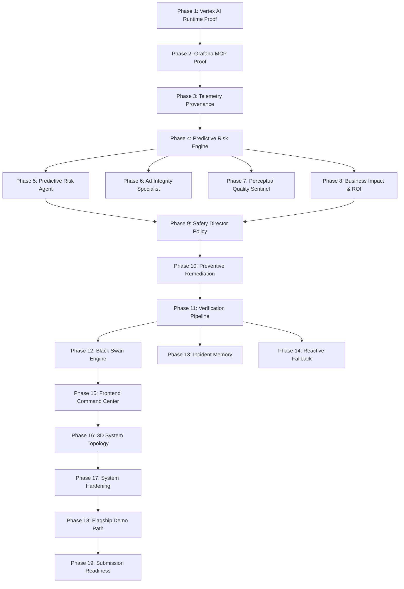

# Tasks: Predictive Media Protection & Black Swan Defense

**Feature Branch**: `003-predictive-defense`  
**Date**: 2026-09-08  
**Spec**: [specs/003-predictive-defense/spec.md](file:///c:/Coding_learning/studio_guardian/studio_guardian/specs/003-predictive-defense/spec.md)  
**Plan**: [specs/003-predictive-defense/plan.md](file:///c:/Coding_learning/studio_guardian/studio_guardian/specs/003-predictive-defense/plan.md)  
**Checklist**: [specs/003-predictive-defense/checklists/implementation.md](file:///c:/Coding_learning/studio_guardian/studio_guardian/specs/003-predictive-defense/checklists/implementation.md)  

---

## Phase 1: Vertex AI Runtime Proof

**Goal**: Verify genuine Google Vertex AI Agent Engine runtime execution path before visual polish.  
**Independent Test**: Execute Incident Commander session and verify truthful runtime metadata (`agent_runtime`, `session_id`, `execution_frames`) streams to client.

- [x] T001 [P] Verify current Google-supported ADK / Agent Engine project configuration in `backend/src/config.py` and `backend/.env`
- [x] T002 Implement minimal root Incident Commander agent in `backend/src/agents/incident_commander.py`
- [x] T003 Connect and execute Incident Commander through Vertex AI Agent Engine client in `backend/src/integrations/google_genai.py`
- [x] T004 Persist session trace frames and execution metadata in `backend/src/persistence/models.py`
- [x] T005 [P] Stream truthful runtime status via Server-Sent Events in `backend/src/api/events.py` and `frontend/src/services/sse.ts`
- [x] T006 Add integration test proving genuine Vertex AI Agent Engine session execution in `backend/tests/integration/test_vertex_runtime.py`

---

## Phase 2: Grafana Partner MCP Proof

**Goal**: Establish authentic Grafana MCP connection over `streamable-http` with strict tool allowlists.  
**Independent Test**: Invoke Prometheus and Loki MCP tools, persist raw unmutated responses, and render in UI evidence feed.

- [x] T007 [P] Configure Grafana MCP endpoint and credentials in `backend/src/config.py` and `docker-compose.yml`
- [x] T008 Establish authenticated streamable-http connection with session management in `backend/src/integrations/mcp_client.py`
- [x] T009 Implement typed Prometheus query tool path (`query_prometheus`) in `backend/src/integrations/mcp_tools.py`
- [x] T010 Execute real Grafana MCP query with error handling and fallback in `backend/src/integrations/mcp_client.py`
- [x] T011 Persist raw tool responses into `runtime_evidence` table in `backend/src/persistence/models.py`
- [x] T012 Display real MCP tool invocation and raw telemetry in `frontend/src/components/command-center/TechnicalEvidencePanel.tsx`
- [x] T013 Add integration test for Grafana MCP handshake and tool calls in `backend/tests/integration/test_grafana_mcp.py`

---

## Phase 3: Telemetry Provenance

**Goal**: Store full lineage from raw Grafana query to dimensionless normalized features.  
**Independent Test**: Query provenance API for any metric and receive exact raw value, SLO bounds, formula, and normalized result.

- [x] T014 Create telemetry evidence entity and schema in `backend/src/persistence/models.py`
- [x] T015 [P] Store datasource identifier in telemetry evidence records in `backend/src/persistence/models.py`
- [x] T016 [P] Store query expression metadata in telemetry evidence records in `backend/src/persistence/models.py`
- [x] T017 [P] Store precise ISO UTC timestamp in telemetry evidence records in `backend/src/persistence/models.py`
- [x] T018 Store observed raw metric value and engineering unit in `backend/src/persistence/models.py`
- [x] T019 Store normalized metric value `[0.0, 1.0]` in `backend/src/persistence/models.py`
- [x] T020 Implement mathematical provenance endpoint `GET /api/v1/predictive/provenance` in `backend/src/api/provenance.py`

---

## Phase 4: Deterministic Predictive Risk Engine

**Goal**: Calculate composite risk score `[0.0, 1.0]`, rate-of-change, and failure horizon using pure transparent mathematics.  
**Independent Test**: Run unit test suite validating min-max clamping, 60s regression slope, saturation boosting, and failure window bounds.

- [x] T021 [P] [US1] Implement GPU utilization min-max clamping (floor 50%, ceil 95%) in `backend/src/prediction/normalizer.py`
- [x] T022 [P] [US1] Implement queue depth normalization (floor 5, ceil 50) in `backend/src/prediction/normalizer.py`
- [x] T023 [P] [US1] Implement latency normalization (floor 150ms, ceil 500ms) in `backend/src/prediction/normalizer.py`
- [x] T024 [P] [US1] Implement 60-second sliding linear regression slope for playback error in `backend/src/prediction/trend.py`
- [x] T025 [P] [US1] Implement viewer surge slope and acceleration in `backend/src/prediction/trend.py`
- [x] T026 [US1] Implement operational baseline deviation comparison in `backend/src/prediction/features.py`
- [x] T027 [US1] Implement deterministic weighted composite risk score with compound saturation boost in `backend/src/prediction/risk_model.py`
- [x] T028 [P] [US1] Implement operational risk tiers (`HEALTHY` through `IMMINENT_RISK`) in `backend/src/prediction/thresholds.py`
- [x] T029 [US1] Implement prediction horizon window calculation (3 to 15 mins) and confidence in `backend/src/prediction/predictor.py`
- [x] T030 [US1] Implement individual signal contributor points breakdown (0 to 100) in `backend/src/prediction/risk_model.py`
- [x] T031 [US1] Add unit test suite validating normalization, weights, trend slope, and risk tiers in `backend/tests/unit/test_predictive_engine.py`

---

## Phase 5: Predictive Risk Agent

**Goal**: Specialist agent integrating Grafana MCP telemetry, risk engine, and Gemini structured hypothesis.  
**Independent Test**: Trigger predictive evaluation and verify structured output matches `PredictiveStatusResponse`.

- [x] T032 [US1] Implement Predictive Risk Agent subclassing `BaseAgent` in `backend/src/agents/predictive_risk_agent.py`
- [x] T033 [US1] Connect Predictive Risk Agent to Grafana MCP telemetry ingestion in `backend/src/agents/predictive_risk_agent.py`
- [x] T034 [US1] Connect agent to deterministic risk calculation and contributor model in `backend/src/agents/predictive_risk_agent.py`
- [x] T035 [US1] Connect Gemini 2.5 structured output for operational causal hypothesis in `backend/src/agents/predictive_risk_agent.py`
- [x] T036 [US1] Persist predictive snapshots, decisions, and evidence in `backend/src/persistence/predictive_repository.py`
- [x] T037 [US1] Integrate predictive assessment cycle into root Incident Commander in `backend/src/agents/incident_commander.py`

---

## Phase 6: Semantic Media Quality & Ad Integrity

**Goal**: Detect SCTE-35 ad splice corruption and cue drift without altering server infrastructure health.  
**Independent Test**: Inject SCTE-35 drift (>350ms) and verify Ad Integrity Agent detects anomaly while CPU/Memory remain nominal.

- [ ] T038 [P] [US3] Add SCTE-35 telemetry fields (drift, alignment, pod drop) in `backend/src/simulator/media_env.py`
- [ ] T039 [US3] Implement configured operational tolerance (±200ms) drift calculation in `backend/src/media/ad_integrity.py`
- [ ] T040 [P] [US3] Implement ad pod frame-drop and mismatch signal in `backend/src/media/ad_integrity.py`
- [ ] T041 [P] [US3] Implement ad beacon tracking error ratio calculation in `backend/src/media/ad_integrity.py`
- [ ] T042 [US3] Create Ad Integrity Specialist Agent in `backend/src/agents/ad_integrity_agent.py`
- [ ] T043 [US3] Connect ad integrity metrics to Grafana MCP tool queries in `backend/src/integrations/mcp_tools.py`
- [ ] T044 [US3] Add deterministic unit tests for SCTE-35 tolerance and ad pod integrity in `backend/tests/unit/test_ad_integrity.py`

---

## Phase 7: Lightweight Perceptual Quality Sentinel

**Goal**: Monitor AV sync offset, audio loudness deviation, and video frame drop scalars.  
**Independent Test**: Inject AV sync offset (>150ms) and loudness deviation (>3 LUFS) and verify Perceptual Quality Sentinel triggers alert.

- [ ] T045 [P] [US3] Implement AV sync drift offset scalar calculation (nominal ±25ms, critical >250ms) in `backend/src/media/perceptual_quality.py`
- [ ] T046 [P] [US3] Implement loudness deviation calculation against -24.0 LUFS target in `backend/src/media/perceptual_quality.py`
- [ ] T047 [P] [US3] Implement video frame-drop ratio calculation in `backend/src/media/perceptual_quality.py`
- [ ] T048 [P] [US3] Implement black-frame percentage anomaly detection in `backend/src/media/perceptual_quality.py`
- [ ] T049 [US3] Create Perceptual Quality Sentinel Agent in `backend/src/agents/perceptual_quality_sentinel.py`
- [ ] T050 [US3] Connect perceptual quality evidence to Grafana MCP in `backend/src/integrations/mcp_tools.py`

---

## Phase 8: Business Impact & Counterfactual ROI

**Goal**: Deterministic financial model computing viewer disruption, ad burn, and net avoided exposure labeled `ESTIMATED`.  
**Independent Test**: Validate financial formulas produce mathematically verified values without generative hallucination.

- [x] T051 [P] [US1] Implement viewer disruption formula based on regional error weighting in `backend/src/business/impact_model.py`
- [x] T052 [P] [US1] Implement advertising revenue burn rate formula (CPM $28.50, 12 ads/hr) in `backend/src/business/impact_model.py`
- [x] T053 [P] [US1] Implement contractual SLA liability penalty tiers in `backend/src/business/impact_model.py`
- [x] T054 [P] [US1] Implement preventive compute scaling cost formula in `backend/src/business/impact_model.py`
- [x] T055 [US1] Implement expected avoided exposure formula (`loss_without_action - loss_after_action - cost`) in `backend/src/business/impact_model.py`
- [x] T056 [US1] Add business impact provenance and formula versioning (`v2.0-sports-standard`) in `backend/src/business/impact_model.py`
- [x] T057 [US1] Add unit tests validating deterministic ROI outputs and unit consistency in `backend/tests/unit/test_business_impact.py`

---

## Phase 9: Safety Director Policy Gatekeeper

**Goal**: Enforce deterministic governance over all autonomous remediation actions.  
**Independent Test**: Verify proposed actions execute only when risk ≥0.80, confidence ≥0.85, blast radius ≤20%, and action is allowlisted.

- [x] T058 [US1] Extend Safety Director policy engine for predictive interventions in `backend/src/policy/safety_director.py`
- [x] T059 [P] [US1] Add composite risk score threshold check (`>= 0.80`) in `backend/src/policy/safety_director.py`
- [x] T060 [P] [US1] Add independent prediction confidence threshold check (`>= 0.85`) in `backend/src/policy/safety_director.py`
- [x] T061 [P] [US1] Add estimated blast-radius threshold check (`<= 20.0%`) in `backend/src/policy/safety_director.py`
- [x] T062 [P] [US1] Add strict action allowlist check (`scale_transcoder_pool`, `shift_traffic`, etc.) in `backend/src/policy/safety_director.py`
- [x] T063 [US1] Implement `REQUIRES_HUMAN_APPROVAL` fallback state and operator audit logging in `backend/src/policy/safety_director.py`

---

## Phase 10: Controlled Preventive Remediation

**Goal**: Implement primary predictive remediation: Transcoder Capacity Scaling (`scale_transcoder_pool`).  
**Independent Test**: Dispatch `scale_transcoder_pool` and confirm pool size doubles in simulation, shedding worker queue depth.

- [x] T064 [US1] Implement `scale_transcoder_pool` operation in `backend/src/agents/remediation.py`
- [x] T065 [US1] Persist prevention action and dispatch parameters in `backend/src/persistence/predictive_repository.py`
- [x] T066 [P] [US1] Emit remediation action event across WebSocket / SSE bus in `backend/src/events/dispatcher.py`
- [x] T067 [US1] Update simulator state to reflect scaled worker capacity in `backend/src/simulator/media_env.py`
- [x] T068 [US1] Implement remediation failure handling and circuit breaking in `backend/src/agents/remediation.py`

---

## Phase 11: Stabilization & Verification Pipeline

**Goal**: Independently verify remediation success using fresh post-action Grafana MCP telemetry.  
**Independent Test**: Confirm system recalculates risk score after 5s delay, compares BEFORE vs. AFTER metrics, and reports `PREDICTED RISK MITIGATED`.

- [x] T069 [US1] Query fresh Grafana MCP telemetry post-remediation delay in `backend/src/agents/verifier.py`
- [x] T070 [US1] Recalculate composite risk score using fresh telemetry in `backend/src/agents/verifier.py`
- [x] T071 [US1] Compare BEFORE vs. AFTER metrics (GPU delta, queue delta, error delta) in `backend/src/agents/verifier.py`
- [x] T072 [US1] Determine prevention outcome (`PREVENTION_VERIFIED`, `PARTIALLY_RECOVERED`, `FAILED`) in `backend/src/agents/verifier.py`
- [x] T073 [US1] Persist verification evidence and protected viewer count in `backend/src/persistence/predictive_repository.py`
- [x] T074 [US1] Display verification outcome and telemetry delta in `frontend/src/components/command-center/ProtectView.tsx`

---

## Phase 12: Deterministic Black Swan Engine

**Goal**: Reproducible chaos injection facility for `TRANSCODER_SURGE` and `SCTE35_CORRUPTION`.  
**Independent Test**: Trigger each scenario from UI/API and verify exact simulated telemetry cascade executes and resets cleanly.

- [ ] T075 [P] [US4] Implement Black Swan scenario registry in `backend/src/demo/scenarios.py`
- [ ] T076 [US4] Implement Transcoder Capacity Surge scenario (GPU 93.4%, queue 48) in `backend/src/demo/scenarios.py`
- [ ] T077 [US4] Implement SCTE-35 Corruption scenario (timing drift >350ms, pod drop) in `backend/src/demo/scenarios.py`
- [ ] T078 [P] [US4] Implement deterministic scenario reset to baseline nominal parameters in `backend/src/demo/scenarios.py`
- [ ] T079 [US4] Add scenario injection and reset endpoints (`POST /api/v1/demo/black-swan/*`) in `backend/src/api/demo.py`
- [ ] T080 [US4] Connect scenario triggers to live `MediaEnvironment` state in `backend/src/simulator/media_env.py`

---

## Phase 13: Incident Memory & Historical Fingerprinting

**Goal**: Index and retrieve operational interventions by telemetry fingerprint using relational storage.  
**Independent Test**: Match current leading symptoms against historical memory and retrieve proven remediation strategy.

- [ ] T081 [P] Create predictive fingerprint model in `backend/src/persistence/fingerprints.py`
- [ ] T082 Persist successful prevention fingerprint in `backend/src/persistence/predictive_repository.py`
- [ ] T083 Implement fingerprint similarity search across past interventions in `backend/src/integrations/vertex_memory.py`
- [ ] T084 Surface matched historical interventions to Predictive Risk Agent in `backend/src/agents/predictive_risk_agent.py`

---

## Phase 14: Reactive Fallback Integration

**Goal**: Seamless transition from predictive monitoring to reactive incident response upon abrupt degradation.  
**Independent Test**: Inject instant playback error spike (>2.0%) and verify Incident Commander executes reactive investigation, traffic shifting, and verification.

- [ ] T085 [US2] Connect predictive monitoring loop to existing reactive workflow in `backend/src/agents/incident_commander.py`
- [ ] T086 [US2] Implement state transition logic from `IMMINENT_RISK` to `ACTIVE_INCIDENT` in `backend/src/agents/incident_commander.py`
- [ ] T087 [US2] Verify Observability Investigator queries Grafana MCP metrics, logs, and traces in `backend/src/agents/investigator.py`
- [ ] T088 [US2] Verify Remediation Agent dispatches regional traffic shift (`shift_traffic`) in `backend/src/agents/remediation.py`
- [ ] T089 [US2] Verify Verification Agent validates stream recovery and resets incident status in `backend/src/agents/verifier.py`

---

## Phase 15: Frontend Operational Command Center

**Goal**: Premium enterprise broadcast operations center with 4 operational views and technical evidence visibility.  
**Independent Test**: Navigate all 4 views (PREDICT, PROTECT, RESPOND, GAME DAY) and verify real-time data binding and provenance drawers.

- [ ] T090 [P] Implement **PREDICT** view with composite risk gauge, trend graph, and failure window in `frontend/src/components/command-center/PredictView.tsx`
- [ ] T091 [P] Implement **PROTECT** view with candidate action, economics, and Safety Director badge in `frontend/src/components/command-center/ProtectView.tsx`
- [ ] T092 [P] Implement **RESPOND** view with incident diagnostics, root cause tree, and recovery log in `frontend/src/components/command-center/RespondView.tsx`
- [ ] T093 [P] Implement **GAME DAY** view with scenario selection cards and "Inject Black Swan" buttons in `frontend/src/components/command-center/GameDayView.tsx`
- [ ] T094 [P] Implement Vertex AI Agent Engine runtime metadata panel in `frontend/src/components/command-center/VertexRuntimePanel.tsx`
- [ ] T095 [P] Implement Technical Evidence Panel showing `Vertex AI → Agent → Grafana MCP → Risk → Gemini` in `frontend/src/components/command-center/TechnicalEvidencePanel.tsx`
- [ ] T096 Implement Data Provenance Drawer showing raw PromQL, formulas, and math derivation in `frontend/src/components/command-center/DataProvenanceDrawer.tsx`
- [ ] T097 [P] Implement Business Impact & Counterfactual ROI panel in `frontend/src/components/command-center/BusinessImpactPanel.tsx`
- [ ] T098 [P] Implement Autonomy & Safety Director policy status panel in `frontend/src/components/command-center/AutonomyPolicyPanel.tsx`
- [ ] T099 [P] Implement interactive Agent Timeline / trace stream in `frontend/src/components/command-center/AgentTimeline.tsx`

---

## Phase 16: Lightweight 3D System Topology

**Goal**: React Three Fiber broadcast system graph visually communicating live stream health, stress, and remediation.  
**Independent Test**: Verify 3D topology renders at 60 fps, pulses red on stressed nodes during surge, and falls back to 2D SVG if WebGL disabled.

- [ ] T100 Create central Live Event broadcast core in `frontend/src/components/canvas3d/SystemTopology3D.tsx`
- [ ] T101 [P] Add infrastructure nodes (Ingest, Transcoder, Packager, ADS, CDN) in `frontend/src/components/canvas3d/InfrastructureNodes.tsx`
- [ ] T102 [P] Add specialist agent nodes (Commander, Predictive, Investigator, Remediation) in `frontend/src/components/canvas3d/AgentNodes.tsx`
- [ ] T103 [P] Add Grafana MCP telemetry node in `frontend/src/components/canvas3d/GrafanaNode.tsx`
- [ ] T104 [P] Add Vertex AI Agent Engine runtime node in `frontend/src/components/canvas3d/VertexAINode.tsx`
- [ ] T105 Implement node stress animation (red pulse on GPU/queue saturation) in `frontend/src/components/canvas3d/StressAnimation.tsx`
- [ ] T106 Implement remediation flow animation (traffic diversion / scaling beam) in `frontend/src/components/canvas3d/RemediationAnimation.tsx`
- [ ] T107 Implement verification recovery animation (calm green stabilization) in `frontend/src/components/canvas3d/VerificationAnimation.tsx`
- [ ] T108 Implement 2D SVG/Canvas fallback component for non-WebGL environments in `frontend/src/components/canvas3d/Fallback2DTopology.tsx`

---

## Phase 17: System Hardening & Comprehensive Testing

**Goal**: Comprehensive automated testing covering all success criteria, edge cases, and failure modes.  
**Independent Test**: Run full test suite (`pytest`) and confirm 100% pass rate across unit, integration, and e2e scenarios.

- [ ] T109 [US1] Implement full end-to-end predictive happy path test (`PREDICT → PREVENT → VERIFY`) in `backend/tests/e2e/test_predictive_workflow.py`
- [ ] T110 [US2] Implement full end-to-end reactive fallback test (`DETECT → INVESTIGATE → REMEDIATE → VERIFY`) in `backend/tests/e2e/test_reactive_workflow.py`
- [ ] T111 [US4] Implement automated test suite for both Black Swan scenarios in `backend/tests/e2e/test_black_swan_scenarios.py`
- [ ] T112 Implement MCP connection failure and timeout test in `backend/tests/integration/test_mcp_failure_modes.py`
- [ ] T113 Implement Gemini API unavailable deterministic fallback test in `backend/tests/unit/test_gemini_fallback.py`
- [ ] T114 Implement remediation execution failure and rollback test in `backend/tests/e2e/test_remediation_failure.py`
- [ ] T115 Implement verification failure and operational escalation test in `backend/tests/e2e/test_verification_failure.py`
- [ ] T116 Implement human approval gate enforcement test in `backend/tests/unit/test_human_approval_gate.py`

---

## Phase 18: Flagship Demonstration Path

**Goal**: Flawless, deterministic live demonstration runnable in under 3 minutes.  
**Independent Test**: Execute the demo script from beginning to end without manual code edits or unexpected failures.

- [ ] T117 [US1] Configure deterministic Transcoder Surge predictive demo scenario in `backend/src/demo/scenarios.py`
- [ ] T118 [US3] Configure deterministic SCTE-35 ad splice corruption scenario in `backend/src/demo/scenarios.py`
- [ ] T119 [US4] Configure combined Black Swan gameday scenario in `backend/src/demo/scenarios.py`
- [ ] T120 Configure instant reset workflow for seamless demo repetition in `backend/src/demo/scenarios.py`
- [ ] T121 [P] Add interactive demo event progression timeline in `frontend/src/components/command-center/DemoTimeline.tsx`
- [ ] T122 Update operational demonstration walkthrough in `DEMO.md`

---

## Phase 19: Submission Readiness & Documentation

**Goal**: Package repository for public open-source submission with comprehensive documentation and diagrams.  
**Independent Test**: Review all markdown documentation, links, licenses, and diagrams for completeness and accuracy.

- [ ] T123 Update primary project documentation and quickstart in `README.md`
- [ ] T124 [P] Update architectural diagrams and multi-agent flow in `docs/ARCHITECTURE.md`
- [ ] T125 [P] Create Grafana MCP integration documentation in `docs/GRAFANA_INTEGRATION.md`
- [ ] T126 [P] Create Vertex AI Agent Engine runtime documentation in `docs/VERTEX_AI_RUNTIME.md`
- [ ] T127 [P] Create mathematical provenance and risk model documentation in `docs/MATHEMATICAL_PROVENANCE.md`
- [ ] T128 Update security policy and credential-handling protocols in `SECURITY.md`
- [ ] T129 Create Google Cloud deployment guide (Cloud Run, Cloud SQL) in `docs/DEPLOYMENT.md`
- [ ] T130 [P] Verify open-source licensing compliance in `LICENSE`
- [ ] T131 Create 3-minute executive presentation and demonstration script in `docs/DEMO_SCRIPT_3MIN.md`

---

## Dependencies & Execution Order

### Phase Dependencies

---

## Parallel Opportunities

- **Phase 1**: T001 (Config) and T005 (SSE client) can run in parallel.
- **Phase 3**: T015, T016, and T017 (metadata fields) can run in parallel.
- **Phase 4**: T021, T022, T023, T024, T025, and T028 (normalization & trend helpers) can run in parallel.
- **Phase 6 & Phase 7**: Can be implemented in parallel with Phase 5.
- **Phase 8**: T051, T052, T053, and T054 (impact formulas) can run in parallel.
- **Phase 15**: T090 through T099 (independent React views and panels) can be developed in parallel.
- **Phase 16**: T101 through T104 (3D node types) can be developed in parallel.
- **Phase 19**: T124 through T130 (documentation guides) can be developed in parallel.

---

## Implementation Strategy: MVP First

1. **MVP Scope (Phases 1–5 & 9–11)**:
   - Prove Vertex AI Agent Runtime execution.
   - Prove Grafana MCP telemetry ingestion.
   - Implement deterministic feature normalization and composite risk model.
   - Connect Predictive Risk Agent and formulate structured hypothesis.
   - Govern Transcoder Capacity Scale via Safety Director.
   - Verify risk mitigation post-action.
   - **Validation Point**: Run `pytest tests/unit/test_predictive_engine.py` and `test_predictive_workflow.py`.

2. **Full Capability (Phases 6–8 & 12–14)**:
   - Add Ad Integrity (SCTE-35 drift) and Perceptual Quality scalars.
   - Add Business Impact & Counterfactual ROI calculations.
   - Implement Black Swan scenario injection and reactive incident fallback.

3. **User Experience & Submission (Phases 15–19)**:
   - Build out the 4 operational views and Data Provenance Drawer.
   - Implement the React Three Fiber 3D system topology.
   - Perform end-to-end hardening and generate final hackathon submission documentation.

---

## Phase 20: Convergence

**Goal**: Close identified gaps between feature spec/plan/constitution and current implementation.

- [x] T132 Fix file encoding of `backend/tests/integration/test_vertex_runtime.py` to UTF-8 without null bytes per Constitution 1 (contradicts) [CRITICAL]
- [x] T133 Add SCTE-35 and perceptual quality telemetry metrics (`scte_timing_drift_ms`, `av_sync_drift_ms`, `loudness_lufs`, `frame_drop_ratio_pct`, `black_frame_ratio_pct`) to `backend/src/simulator/media_env.py` per FR-007 (missing) [HIGH]
- [x] T134 Implement SCTE-35 operational tolerance evaluator in `backend/src/media/ad_integrity.py` per FR-007, Constitution 8 & 9 (missing) [HIGH]
- [x] T135 Implement lightweight perceptual quality metrics (AV sync, loudness, frame-drop, black-frame) in `backend/src/media/perceptual_quality.py` per FR-007, Constitution 8 & 10 (missing) [HIGH]
- [x] T136 Add `AdIntegrityEvent`, `MediaQualityEvent`, and `BlackSwanRun` entities to `backend/src/persistence/models.py` per FR-002, FR-007, FR-012 (missing) [HIGH]
- [x] T137 Create `AdIntegrityAgent` in `backend/src/agents/ad_integrity_agent.py` per FR-007, US3/AC1 (missing) [HIGH]
- [x] T138 Create `PerceptualQualitySentinel` in `backend/src/agents/perceptual_quality_sentinel.py` per FR-007, US3/AC2 (missing) [HIGH]
- [x] T139 Create deterministic Black Swan scenario engine in `backend/src/demo/scenarios.py` implementing `TRANSCODER_SURGE` and `SCTE35_CORRUPTION` per FR-012, Constitution 13, US4 (missing) [HIGH]
- [x] T140 Expose Black Swan chaos endpoints (`/api/v1/demo/black-swan/*`) in `backend/src/api/demo.py` per FR-012, US4 (missing) [HIGH]
- [x] T141 Connect `/api/v1/predictive/provenance` to database snapshots and implement `frontend/src/components/command-center/DataProvenanceDrawer.tsx` per FR-002, Constitution 4, Plan §10 (partial) [HIGH]
- [x] T142 Refactor frontend command center into 4 operational views (`PredictView.tsx`, `ProtectView.tsx`, `RespondView.tsx`, `GameDayView.tsx`) per Constitution 16, Plan §10 (partial) [HIGH]
- [x] T143 Implement React Three Fiber 3D broadcast topology graph and 2D fallback in `frontend/src/components/canvas3d/` per Constitution 16, Plan §10 (missing) [MEDIUM]
- [x] T144 Implement automated E2E and failure mode test suites in `backend/tests/` per SC-001, SC-002, SC-006 (missing) [HIGH]
- [x] T145 Create gameday demonstration timeline and documentation guides (`DEMO.md`, `docs/GRAFANA_INTEGRATION.md`, `docs/VERTEX_AI_RUNTIME.md`, `docs/MATHEMATICAL_PROVENANCE.md`, `docs/DEMO_SCRIPT_3MIN.md`) per Constitution 17 & 18 (missing) [MEDIUM]
